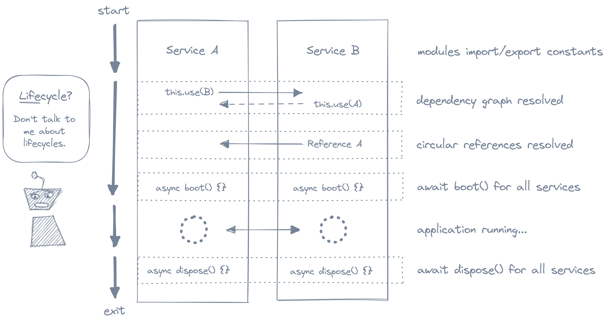

# 

[][3]
[][2]
[](LICENSE.md)


Roboot is a minimal dependency container and bootstrapping library for
JavaScript. It provides just enough stucture to write clean testable code
without sacrificing simplicity and flexability.

## Features

- Helps avoid module side-effects and global state
- Supports circlular dependencies
- Manages instance lifecycle with support for asynchronous `boot` and `dispose`
- Single JavaScript file with TypeScript annotations in JSDoc comments
- Zero dependencies
- Well tested

## Install

### NPM

```sh
npm install roboot
```

### Vendor

Copy `roboot.mjs` direclty in to your project. It does not have any dependencies
and a build step is not needed.

## Lifecycle



## Basic Usage

```js
import { Container, Service } from "roboot";

class Logger extends Service  {
  async boot() {
    await new Promise((resolve) => setTimeout(resolve, 1000));
    this.info("Logger booted");
  }

  async dispose() {
    await this.disposed(Counter);
    this.info("Logger disposed");
  }

  info(message) {
    console.log(`INFO: ${message}`);
  }
}

class Counter extends Service {
  logger = this.use(Logger);
  count = 0;
  intervalHandle;

  async boot() {
    await this.booted(Logger);
    this.logger.info("Counter booted");
  }

  async dispose() {
    clearInterval(this.intervalHandle);
    await new Promise((resolve) => setTimeout(resolve, 1000));
    this.logger.info("Counter disposed");
  }

  start() {
    this.logger.info("Starting counter")
    this.intervalHandle = setInterval(() => {
      this.count += 1;
      this.logger.info(this.count);
    }, 1000);
  }
}

function sigintHandler(container) {
  process.on("SIGINT", async () => {
    await container.dispose();
    process.exit(130);
  });
}

new Container()
  .apply(sigintHandler)
  .boot(Counter)
  .then((counter) => counter.start())
  .catch((err) => console.error(err));
```

## API

### `Container`

A `Container` handles resolving instances of dependencies (including circular
dependencies) and executing lifecycle hooks. It also supports binding
alternative implementations for a `Provider`.

#### `container.boot(Root: Provider | Service) => Promise<ProvidedBy<Root>>`

Create an instance of a root provider resolving and booting all dependencies
before the returned promise is resolved with the instance.

#### `container.bind(Provider: Provider | Service, Implementation: Provider | Service) => Container`

Provide an alternate implementation for a given provider/service in the context
of this container. This must be called before `boot()`.

#### `container.apply((container: Container) => void)`

Call a callback function with the container instance and return the container
instance. This can be useful for referencing the container when chaining.

### `Provider<T> | Service`

`Provider` and `Service` are both abstract base classes intended to be extended.
They enable resolving dependencies from the container and defining lifecycle
hooks. A `Provider<T>` can resolve to any value by implementing the
`provide() => T` method. `Service` is a special case provider that always
provides itself.

#### `provider.use(Dependency: Provider | Service) => ProvidedBy<Dependency>`

`@protected`

Create or re-use an existing instance of the dependency from the container. This
should be called synchronously when instantiating the class, typically via an
[instance field initializer][1].

#### `provider.booted(Dependency: Provider | Service) => Promise<void>`

`@protected`

The `booted` method used to support initialization dependency order. The
returned promise will resolve once the `boot` method of the dependency
has finished. This should only be called within the `boot` method of a
`Provider` or `Service` child class.

#### `provider.dispoosed(Dependency: Provider | Service) => Promise<void>`

`@protected`

The `disposed` method used to support clean up dependency order. The
returned promise will resolve once the `dispose` method of the dependency
has finished. This should only be called within the `dispose` method of a
`Provider` or `Service` child class.

#### `provider.boot() => Promise<void>`

This may be optionally implemented by a child class to execute initialization
code that should run when booting the container. There is no need to call
`super.boot()`.

#### `provider.dispose() => Promise<void>`

This may be optionally implemented by a child class to execute clean up
code that should run when disposing of the container. There is no need to call
`super.boot()`.

#### `provider.provide() => T`

For child classes of `Provider<T>` only. `Service` implements its own `provide`.

The `provide` method must be implemented by each child class of `Provider<T>`.
It returns the value that will be returned when `use` is called with this class.

## License

Roboot is licensed under the MIT licese. See [LICENSE.md](LICENSE.md).

[1]: https://developer.mozilla.org/en-US/docs/Web/JavaScript/Reference/Classes/Public_class_fields#public_instance_fields
[2]: https://npmjs.com/package/roboot
[3]: https://github.com/brentropy/roboot/actions?query=branch%3Amain